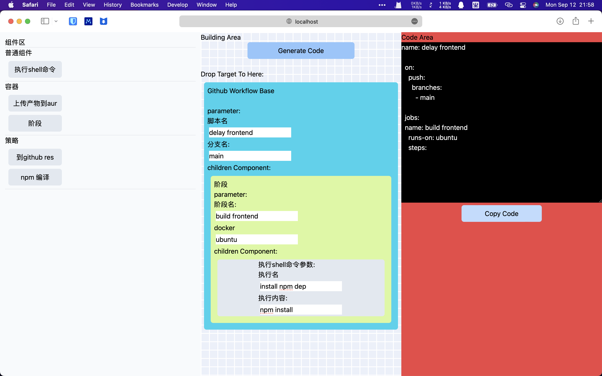

Workflow Generate
a tool to generate github action yaml and etc.

it is WIP. It didn't working now.

Document: in writing ...

todo:
-[ ] a better UI
-[ ] i18n
-[ ] support generate github action yaml configure completely
-[ ] add unit test and e2e test
-[ ] a better UX
-[ ] support plugins to extend block
-[ ] support other workflow generate(gitlab,ansible)

